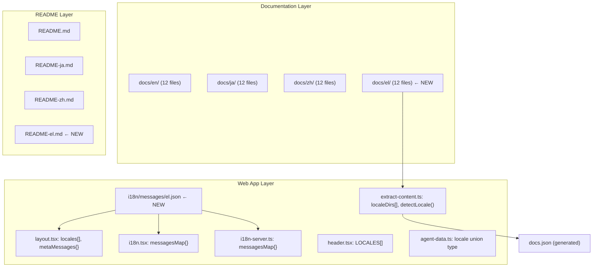

# Design Document: Greek Translation

## Overview

This design adds Greek (el) as a fourth locale to the Learn Claude Code workshop, achieving full parity with the existing English (en), Japanese (ja), and Chinese (zh) translations. The change spans three surfaces:

1. Markdown documentation files (`docs/el/`)
2. Root-level README (`README-el.md`)
3. Next.js web application (i18n messages, locale routing, language switcher, content extraction, TypeScript types)

The approach follows the exact patterns established by the Japanese and Chinese translations — no new abstractions or infrastructure are needed. Every change is additive: a new directory, a new JSON file, and small insertions into existing arrays/maps/union types.

## Architecture

The existing multi-locale architecture is a straightforward "add a row" pattern. Greek slots into every layer without structural changes.



### Design Decisions

- **No new infrastructure**: Greek follows the identical pattern used for ja/zh. No new config files, routing logic, or build steps are required.
- **Fallback to English**: The existing `messagesMap[locale] || en` pattern in `i18n.tsx` and `i18n-server.ts` already provides English fallback for any missing keys, satisfying Requirement 3.3.
- **Static generation**: Adding `"el"` to the `locales` array in `layout.tsx` ensures `generateStaticParams` produces the `/el` route at build time.

## Components and Interfaces

### 1. Documentation Files (`docs/el/`)

12 new markdown files mirroring `docs/en/`:

| File | Content |
|------|---------|
| `docs/el/s01-the-agent-loop.md` | Greek translation of session 1 |
| `docs/el/s02-tool-use.md` | Greek translation of session 2 |
| `docs/el/s03-todo-write.md` | Greek translation of session 3 |
| `docs/el/s04-subagent.md` | Greek translation of session 4 |
| `docs/el/s05-skill-loading.md` | Greek translation of session 5 |
| `docs/el/s06-context-compact.md` | Greek translation of session 6 |
| `docs/el/s07-task-system.md` | Greek translation of session 7 |
| `docs/el/s08-background-tasks.md` | Greek translation of session 8 |
| `docs/el/s09-agent-teams.md` | Greek translation of session 9 |
| `docs/el/s10-team-protocols.md` | Greek translation of session 10 |
| `docs/el/s11-autonomous-agents.md` | Greek translation of session 11 |
| `docs/el/s12-worktree-task-isolation.md` | Greek translation of session 12 |

Translation rules:
- Prose (headings, explanations, mottos) → Greek
- Code snippets, variable names, terminal commands → unchanged
- Heading structure, code blocks, ASCII diagrams → preserved exactly

### 2. Root README (`README-el.md`)

A Greek translation of `README.md` following the same rules as the doc files. All code blocks, architecture diagrams, and command examples remain in their original form.

The language selector line at the top of every README file must be updated to include Greek:

```
[English](./README.md) | [中文](./README-zh.md) | [日本語](./README-ja.md) | [Ελληνικά](./README-el.md)
```

This line must be updated in all four README files: `README.md`, `README-ja.md`, `README-zh.md`, and the new `README-el.md`.

### 3. I18n Messages (`web/src/i18n/messages/el.json`)

A new JSON file with the same structure and keys as `en.json`, with string values translated to Greek. The file contains these top-level namespaces: `meta`, `nav`, `home`, `version`, `sim`, `timeline`, `layers`, `compare`, `diff`, `sessions`, `layer_labels`, `viz`.

### 4. Locale Registration (Web App Config Files)

Files requiring `"el"` registration:

| File | Change |
|------|--------|
| `web/src/app/[locale]/layout.tsx` | Add `import el` + `"el"` to `locales[]` + `el` to `metaMessages{}` |
| `web/src/lib/i18n.tsx` | Add `import el` + `el` to `messagesMap{}` |
| `web/src/lib/i18n-server.ts` | Add `import el` + `el` to `messagesMap{}` |

### 5. Language Switcher (`web/src/components/layout/header.tsx`)

Add `{ code: "el", label: "Ελληνικά" }` to the `LOCALES` array. The existing `switchLocale` function handles navigation automatically.

### 6. Content Extraction (`web/scripts/extract-content.ts`)

Two changes:
- Add `"el"` to the `localeDirs` array
- Add an `el` branch to the `detectLocale` function

### 7. TypeScript Types (`web/src/types/agent-data.ts`)

Extend the `locale` union type in `DocContent` from `"en" | "zh" | "ja"` to `"en" | "zh" | "ja" | "el"`.

## Data Models

### DocContent (updated)

```typescript
export interface DocContent {
  version: string;
  locale: "en" | "zh" | "ja" | "el";  // "el" added
  title: string;
  content: string; // raw markdown
}
```

### detectLocale return type (updated)

```typescript
function detectLocale(relPath: string): "en" | "zh" | "ja" | "el" {
  if (relPath.startsWith("el/") || relPath.startsWith("el\\")) return "el";
  if (relPath.startsWith("zh/") || relPath.startsWith("zh\\")) return "zh";
  if (relPath.startsWith("ja/") || relPath.startsWith("ja\\")) return "ja";
  return "en";
}
```

### el.json structure (mirrors en.json)

```json
{
  "meta": { "title": "...", "description": "..." },
  "nav": { "home": "...", "timeline": "...", ... },
  "home": { "hero_title": "...", ... },
  "version": { ... },
  "sim": { ... },
  "timeline": { ... },
  "layers": { ... },
  "compare": { ... },
  "diff": { ... },
  "sessions": { ... },
  "layer_labels": { ... },
  "viz": { ... }
}
```

### README language selector line

```
[English](./README.md) | [中文](./README-zh.md) | [日本語](./README-ja.md) | [Ελληνικά](./README-el.md)
```
